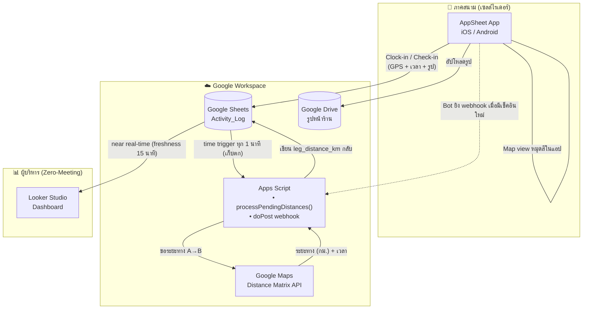

# YourFin Rider KPI — ระบบติดตาม KPI เซลล์ไรเดอร์แบบเรียลไทม์

> **โจทย์:** ธุรกิจสินเชื่อผ่อนโทรศัพท์มือถือ ที่มีทีม "เซลล์ไรเดอร์" เดินทางไปเปิดคู่ค้ากับ
> ร้านมือถือพาร์ทเนอร์ (Samsung / Vivo / Oppo) เพื่อเสนอโปรแกรมผ่อนชำระและปิดดีล
>
> **เป้าหมาย:** สร้าง *Automated KPI Dashboard* รองรับวัฒนธรรม **Zero‑Meeting** —
> ผู้บริหารเห็นผลงานทีมแบบ near real‑time โดยไม่ต้องเรียกประชุมอัปเดตงาน

เอกสารชุดนี้คือ **พิมพ์เขียวระบบ (System Blueprint)** ฉบับสถาปนิก พร้อม **โค้ด Google Apps Script
ที่ใช้งานได้จริง** และ **เทมเพลตโครงสร้าง Google Sheets** เพื่อให้ทีมนำไปตั้งระบบได้ทันที

---

## 1. ภาพรวมสถาปัตยกรรม (Architecture at a glance)

เลือก **Google Stack ทั้งสาย** เพื่อให้ทุกชิ้นเชื่อมกันแบบ native, ต้นทุนต่ำ, และทีมเล็กดูแลเองได้:

| ชั้น (Layer) | เครื่องมือที่เลือก | เหตุผล |
|---|---|---|
| **Frontend (แอปเซลล์)** | **AppSheet** | No‑code, ลง iOS/Android ได้จริง, จับ GPS อัตโนมัติ, มี Map view หมุดสี, อัปโหลดรูปเข้า Drive, ทำงาน **offline** แล้ว sync ได้ — เหมาะกับงานภาคสนามสัญญาณไม่นิ่ง |
| **Database** | **Google Sheets** | เป็นทั้งฐานข้อมูลและจุดเชื่อมร่วมของทุกเครื่องมือ ตั้งง่าย ทีมอ่านออก |
| **Backend Logic** | **Google Apps Script + Distance Matrix API** | คำนวณ "ระยะทางขับขี่จริง" ระหว่างจุดเช็คอิน แล้วเขียนกลับลง Sheet อัตโนมัติ |
| **Dashboard** | **Looker Studio** | ต่อ Sheets ได้ทันที, ทำ Scorecard / Coverage Map / Conversion ได้ครบ |



---

## 2. Data Flow ทั้ง 3 เฟส

**เฟส 1 — ภาคสนาม (AppSheet):**
1. **Clock‑in** "เริ่มงาน" → จับ `lat/lng` + `event_time` อัตโนมัติ → สร้างแถว `event_type = CLOCK_IN` (จุดตั้งต้น A0)
2. **Store Check‑in** "เพิ่มข้อมูลการเข้าพบ" → จับ GPS อัตโนมัติ → กรอกสั้น ๆ (ชื่อร้าน, แบรนด์, สถานะ สำเร็จ/ปฏิเสธ/รอตัดสินใจ, รูปหน้าร้าน) → แถว `event_type = CHECK_IN`
3. **Map view** ในแอป แสดงหมุดร้านแยกสี (🟢 ปิดดีล / ⚪ เยือนแล้วยังไม่ปิด / 🟠 รอตัดสินใจ / 🔴 ปฏิเสธ)

**เฟส 2 — หลังบ้าน (Sheets + Apps Script):**
1. ข้อมูลไหลเข้า `Activity_Log` พร้อม `calc_status = PENDING`
2. Apps Script ทำงาน (webhook เรียลไทม์ + time trigger เก็บตก) → หา "จุดก่อนหน้า" ของเซลล์คนเดิมในวันเดียวกัน → เรียก **Distance Matrix API** → เขียน `leg_distance_km`, `leg_duration_min`, `calc_status = DONE`
3. สูตรใน Sheets (หรือ `buildDailySummary()`) สรุปยอดรายวันอัตโนมัติ

**เฟส 3 — แดชบอร์ด (Looker Studio):**
- ยอดปิดคู่ค้ารายวัน · ระยะทางเดินทางรวม (กม.) · **Coverage Map** · **Conversion Rate** พร้อมฟิลเตอร์ วัน/เซลล์/แบรนด์/พื้นที่

---

## 3. โครงสร้างไฟล์ในรีโป

```
yourfin_rifder/
├─ README.md                     ← ภาพรวม + สถาปัตยกรรม (ไฟล์นี้)
├─ docs/
│  ├─ 01-architecture.md         ← เจาะลึกสถาปัตยกรรม, sequence diagram, latency budget
│  ├─ 02-data-model.md           ← พจนานุกรมข้อมูล (ทุกแท็บ/ทุกคอลัมน์/ชนิดข้อมูล)
│  ├─ 03-frontend-appsheet.md    ← คู่มือสร้างแอป AppSheet ทีละขั้น (GPS, หมุดสี, ฟอร์ม, สิทธิ์)
│  ├─ 04-backend-apps-script.md  ← ตั้งค่า GCP/API key, deploy web app, ผูก trigger
│  ├─ 05-sheets-formulas.md      ← สูตรสรุปรายวัน (QUERY / COUNTIFS / SUMIFS)
│  ├─ 06-dashboard-looker.md     ← สร้าง Looker Studio + Coverage Map + Conversion
│  ├─ 07-security-pdpa-cost.md   ← PDPA, ความปลอดภัย API key, ประมาณการต้นทุน, การสเกล
│  └─ 08-rollout-plan.md         ← แผนสร้าง/นำร่อง/โรลเอาต์ + Definition of Done
├─ apps-script/
│  ├─ Config.gs                  ← ค่าคงที่/การตั้งค่า
│  ├─ DistanceMatrix.gs          ← ตัวห่อเรียก Distance Matrix API (+ cache + backoff)
│  ├─ Code.gs                    ← sweeper + doPost webhook + triggers
│  ├─ DailySummary.gs            ← สร้างตารางสรุปรายวันด้วยสคริปต์ (ทางเลือก)
│  └─ appsscript.json            ← manifest (timezone, scopes, web app)
└─ sheets-templates/             ← นำเข้าเป็นแท็บใน Google Sheets ได้เลย
   ├─ Activity_Log.csv
   ├─ Users.csv
   ├─ Stores.csv
   └─ Daily_Summary.csv
```

---

## 4. Quickstart (ลำดับการตั้งระบบ)

> รายละเอียดแต่ละขั้นอยู่ในโฟลเดอร์ `docs/`

1. **สร้าง Google Sheet** ชื่อ `YourFin Rider KPI` แล้วนำเข้าไฟล์ใน `sheets-templates/` เป็น 4 แท็บ
   ตั้ง **Time zone = (GMT+07:00) Bangkok** ที่ `File ▸ Settings` *(สำคัญต่อ TODAY()/รายงาน)*
2. **Google Cloud** เปิดโปรเจกต์ → เปิดใช้ **Distance Matrix API** → ตั้ง **Billing** → สร้าง **API Key** แล้ว *restrict* (ดู `docs/04`)
3. **Apps Script** (Extensions ▸ Apps Script) วางไฟล์จาก `apps-script/` → ใส่ `MAPS_API_KEY`, `WEBHOOK_SECRET` ใน Script Properties → รัน `setupTriggers()` → Deploy เป็น **Web app**
4. **AppSheet** สร้างแอปจาก Sheet เดียวกัน → ตั้งฟอร์ม Clock‑in/Check‑in, Map view หมุดสี, Security filter, และ Bot ยิง webhook (ดู `docs/03`)
5. **Looker Studio** ต่อ Sheet → สร้าง Scorecard / Time series / Coverage Map / Conversion (ดู `docs/06`)
6. **นำร่อง** กับเซลล์ 2–3 คน 1 สัปดาห์ ปรับจูน แล้วค่อยโรลเอาต์ (ดู `docs/08`)

---

## 5. เรื่องที่สถาปนิกต้อง "พูดตรง ๆ" ก่อนเริ่ม

- **"เรียลไทม์" ที่ทำได้จริงคือ *near* real‑time (ราว 1–15 นาที):** AppSheet sync → Sheet (วินาที) → Apps Script เติมระยะทาง (วินาที–1 นาที) → Looker cache (ตั้งได้ต่ำสุด 15 นาที). สำหรับ Zero‑Meeting daily‑ops ระดับนี้ "พอเหลือเฟือ" หากต้องการ sub‑second จริง ๆ ต้องขยับไป BigQuery + Streaming ซึ่ง overkill สำหรับสเกลนี้
- **PDPA (พ.ร.บ.คุ้มครองข้อมูลส่วนบุคคล):** ระบบเก็บ **พิกัด GPS ของพนักงาน** และ **ข้อมูลร้านค้า/เจ้าของร้าน** → ต้องมี *หนังสือแจ้ง/ขอความยินยอม* ระบุวัตถุประสงค์ และจำกัดสิทธิ์เข้าถึง (ละเอียดใน `docs/07`)
- **ต้นทุน:** Distance Matrix คิดเป็น *element* (1 leg ≈ 1 element). ประมาณการทีม 10 คน × 15 เช็คอิน/วัน × 22 วัน ≈ 3,300 element/เดือน — อยู่ในระดับหลักร้อยบาท/เดือน (ตรวจราคา + free tier ปัจจุบันของ Google Maps Platform) ส่วน AppSheet คิดต่อผู้ใช้/เดือน

---

## 6. ตัวเลือกสถาปัตยกรรม (ถ้าไม่อยากใช้ AppSheet)

| ทางเลือก Frontend | ข้อดี | ข้อแลก |
|---|---|---|
| **AppSheet** *(แนะนำ)* | ผูก Sheets/GAS แน่น, GPS+Map+Photo มาให้, offline, สร้างไว | คุม UI ละเอียดได้จำกัด, ค่าไลเซนส์ต่อ user |
| **Glide** | UI สวย ตั้งไว | ฟีเจอร์ GIS/automation ยืดหยุ่นน้อยกว่า |
| **FlutterFlow / Flutter (custom)** | คุม UX/แผนที่ได้เต็มที่ | ต้องมีนักพัฒนา, เวลา/งบสูงกว่ามาก |

> เอกสารชุดนี้ออกแบบบน **AppSheet** เป็นหลัก แต่ Data Model / Apps Script / Looker
> ใช้ซ้ำได้กับทุก frontend เพราะทุกอย่างคุยกันผ่าน Google Sheets เป็นสัญญากลาง (contract)

---

ดูรายละเอียดเชิงลึกได้ที่โฟลเดอร์ [`docs/`](docs/) — เริ่มที่ [`docs/01-architecture.md`](docs/01-architecture.md)
