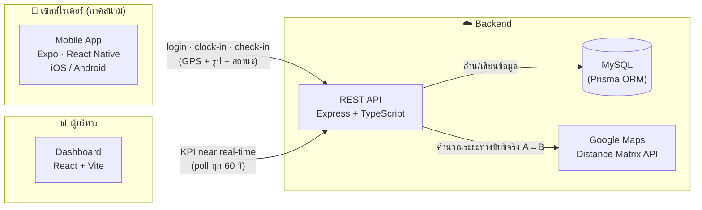

# YourFin Rider 🛵

ระบบติดตามทีม **"เซลล์ไรเดอร์"** ภาคสนามแบบเรียลไทม์ สำหรับธุรกิจสตาร์ทอัพ **YourFin**
(สินเชื่อผ่อนชำระโทรศัพท์มือถือ) — เซลล์ขี่มอเตอร์ไซค์ลงพื้นที่ไปเปิดคู่ค้ากับร้านมือถือพาร์ทเนอร์
(เน้นแบรนด์ Samsung / Vivo / Oppo ฯลฯ) เพื่อเสนอโครงสร้างราคาและระบบผ่อนชำระ

> **เป้าหมาย:** เซลล์อัปเดตสถานะหน้างานผ่านแอปมือถือ (เช็คอิน + ถ่ายรูป + เก็บพิกัด GPS)
> และผู้บริหารเห็นประสิทธิภาพทีมแบบ near real-time ผ่าน Dashboard — ลดการประชุมอัปเดตงาน

---

## 🏗️ สถาปัตยกรรม



| ชั้น | เทคโนโลยี | หน้าที่ |
|---|---|---|
| **Mobile (แอปเซลล์)** | Expo + React Native + TypeScript | เช็คอิน, ถ่ายรูปหน้าร้าน, เก็บพิกัด GPS, ดูแผนที่หมุดสี, clock-in/out |
| **Backend** | Node.js + Express + TypeScript + Prisma | REST API, JWT auth + RBAC, คำนวณระยะทาง, สรุป KPI |
| **Database** | **MySQL** | จัดเก็บผู้ใช้ / ร้านค้า / กิจกรรม GPS |
| **Backend Logic** | **Google Maps Distance Matrix API** | คำนวณ "ระยะทางขับขี่จริง" ระหว่างจุดเช็คอิน (มี Haversine fallback) |
| **Dashboard (ผู้บริหาร)** | React + Vite + Recharts + Leaflet | Scorecard, Leaderboard, แนวโน้มรายวัน, Coverage Map, Activity Feed |

---

## 📁 โครงสร้างรีโป (monorepo)

```
yourfin_rifder/
├─ backend/          ← REST API (Express + Prisma + MySQL) + Google Maps  ✅ พร้อมใช้/ทดสอบแล้ว
│  ├─ prisma/        ← schema, migrations, seed
│  └─ src/           ← config, middleware, services, controllers, routes
├─ mobile/           ← แอปเซลล์ (Expo / React Native)
├─ dashboard/        ← แดชบอร์ดผู้บริหาร (React + Vite)
├─ docs/
│  └─ API_CONTRACT.md  ← สัญญา API ที่ mobile + dashboard ยึดร่วมกัน
├─ legacy/           ← พิมพ์เขียวเดิม (No-code: Google Sheets + AppSheet + Apps Script + Looker)
│                       เก็บไว้เป็น "ทางเลือกแบบไม่เขียนโค้ด" — ดู legacy/README.md
├─ docker-compose.yml  ← MySQL (+ Adminer) สำหรับ dev
└─ README.md
```

> 💡 **มีสองทางเลือกในรีโปนี้:**
> - **โค้ดจริง (แนะนำสำหรับสเกลธุรกิจ):** `backend/` + `mobile/` + `dashboard/` — ฐานข้อมูล MySQL, คุม UX/ความปลอดภัยได้เต็มที่
> - **No-code (เริ่มเร็ว/ต้นทุนต่ำ):** `legacy/` — Google Sheets + AppSheet + Looker Studio

---

## 🔄 Data Flow

1. **ภาคสนาม** — เซลล์เปิดแอป → **เริ่มงาน (Clock-in)** จับ GPS เป็นจุดตั้งต้นของวัน
2. **เข้าพบร้าน (Check-in)** — จับ GPS อัตโนมัติ, ถ่ายรูปหน้าร้าน, เลือกแบรนด์ + สถานะ (ปิดดีล/รอตัดสินใจ/ปฏิเสธ)
3. **Backend** — บันทึกลง MySQL แล้วคำนวณ `leg_distance_km` จาก "จุดก่อนหน้า" ของเซลล์คนเดิมในวันเดียวกัน
   ผ่าน **Google Maps Distance Matrix** (mode=driving) — สะท้อนค่าน้ำมัน/ความเหนื่อยจริง
4. **เลิกงาน (Clock-out)** — ปิดวันทำงาน
5. **Dashboard** — ผู้บริหารเห็น KPI รวม, ตารางจัดอันดับเซลล์, แนวโน้มรายวัน, แผนที่ coverage แบบ near real-time

### 💰 คอมมิชชั่น & Affiliate & ถอนเงิน

- ปิดดีลสำเร็จ (check-in สถานะ `SUCCESS`) → ไรเดอร์ได้ **คอมคงที่ต่อดีล** (`commissionPerDeal`)
- **Affiliate หลายชั้น:** ระบบไล่จ่ายค่าแนะนำขึ้นสายแนะนำ (สูงสุด 5 ชั้น) ให้คนที่แนะนำไรเดอร์เข้ามา
- **กระเป๋าเงินไรเดอร์ (ในแอป):** ดูยอดถอนได้ / รายได้สะสม / ledger แล้วยื่น **คำขอถอน**
- **หน้า Admin:** เห็นรายการคำขอถอน → อนุมัติ/ปฏิเสธ/จ่าย พร้อม **แนบรูปสลิป** + ตั้งค่าคอม/สายแนะนำของแต่ละคน
- **บัญชีรับเงิน:** ไรเดอร์ตั้งบัญชีได้ **1 บัญชี** (ในแอป) — การถอนใช้บัญชีนั้นเสมอ (ต้องตั้งก่อนถอน)

### 👤 การจัดการผู้ใช้ & สิทธิ์ (RBAC)

- **4 สิทธิ์:** `SALES` (แอป) · `MANAGER` (dashboard การขาย+การเงิน) · `FINANCE` (เฉพาะงานถอน/สลิป) · `ADMIN` (ทั้งหมด)
- **ออกบัญชีผู้ใช้:** `ADMIN` และ `MANAGER` สร้าง/แก้ไข/รีเซ็ตรหัสผู้ใช้แต่ละ role ได้ —
  โดย `MANAGER` ทำได้ทุก role **ยกเว้น `ADMIN`** (มีเฉพาะ ADMIN ที่จัดการ ADMIN ได้)

---

## 🚀 Quickstart

> ต้องมี **Node.js ≥ 18** และ **Docker** (สำหรับ MySQL) หรือ MySQL ที่ติดตั้งเอง

### 1) ฐานข้อมูล + Backend

```bash
# จาก root ของ repo — สตาร์ท MySQL
docker compose up -d mysql

cd backend
cp .env.example .env            # ใส่ GOOGLE_MAPS_API_KEY ถ้ามี (เว้นว่างได้ — ใช้ Haversine fallback)
npm install
npm run prisma:migrate          # สร้างตาราง
npm run seed                    # ข้อมูลตัวอย่าง (ผู้ใช้/ร้าน/กิจกรรม 10 วัน)
npm run dev                     # API ที่ http://localhost:4000
```

### 2) Dashboard (ผู้บริหาร)

```bash
cd dashboard
npm install
cp .env.example .env            # VITE_API_URL=http://localhost:4000/api
npm run dev                     # เปิดเบราว์เซอร์ตามที่ Vite แจ้ง
```

### 3) Mobile (เซลล์)

```bash
cd mobile
npm install
npx expo start                  # สแกน QR ด้วย Expo Go (iOS/Android)
```
> บนอุปกรณ์จริง ต้องตั้ง `apiBaseUrl` ใน `mobile/app.json` ให้ชี้ไปที่ **LAN IP** ของเครื่อง backend
> (เช่น `http://192.168.1.50:4000/api`) เพราะ `localhost` บนมือถือหมายถึงตัวมือถือเอง

---

## 🔑 บัญชีทดสอบ (จาก seed)

| Role | email | password | ใช้กับ |
|---|---|---|---|
| ADMIN | `admin@yourfin.co` | `admin1234` | จัดการผู้ใช้/ระบบทั้งหมด |
| MANAGER | `manager@yourfin.co` | `manager1234` | **Dashboard** การขาย + ออกบัญชีผู้ใช้ |
| FINANCE | `finance@yourfin.co` | `finance1234` | เฉพาะงานถอนเงิน/สลิป |
| SALES | `somchai@yourfin.co` *(และ suda / anan / nong)* | `sales1234` | **Mobile app** |

---

## 🗺️ Google Maps

ใส่ `GOOGLE_MAPS_API_KEY` (เปิดใช้ **Distance Matrix API** + Billing) ใน `backend/.env`
เพื่อให้ระบบคำนวณระยะทางขับขี่จริงตามถนน หากเว้นว่าง ระบบจะใช้ **Haversine** (เส้นตรง) เป็น fallback
ทำให้รัน/เดโมได้ทันทีโดยไม่ต้องมีคีย์

---

## 🔒 ข้อควรระวังก่อนขึ้นจริง (Production)

- เปลี่ยน `JWT_SECRET` เป็นค่าสุ่มยาว และตั้ง `CORS_ORIGINS` ให้เจาะจงโดเมน dashboard
- ย้ายการเก็บรูปจาก local disk ไปที่ object storage (S3 / Google Cloud Storage)
- จำกัดสิทธิ์ (restrict) Google Maps API key และตั้ง budget alert
- **PDPA:** ระบบเก็บ *พิกัด GPS ของพนักงาน* และ *ข้อมูลร้านค้า/เจ้าของร้าน* →
  ต้องมีหนังสือแจ้ง/ขอความยินยอม ระบุวัตถุประสงค์ และจำกัดสิทธิ์การเข้าถึงข้อมูล

---

## 📚 เอกสารเพิ่มเติม

- [`docs/API_CONTRACT.md`](docs/API_CONTRACT.md) — สัญญา API ทั้งหมด
- [`backend/README.md`](backend/README.md) — รายละเอียด backend
- [`mobile/README.md`](mobile/README.md) — รายละเอียดแอปเซลล์
- [`dashboard/README.md`](dashboard/README.md) — รายละเอียดแดชบอร์ด
- [`legacy/README.md`](legacy/README.md) — พิมพ์เขียว No-code ทางเลือก
