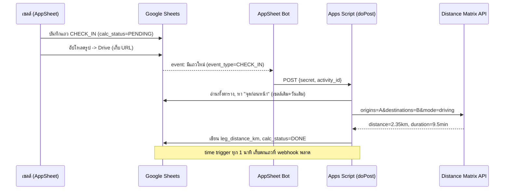

# 01 — สถาปัตยกรรมระบบ (System Architecture)

## 1.1 หลักการออกแบบ (Design Principles)

1. **Single Source of Truth = Google Sheets** — ทุกเครื่องมือ (AppSheet, Apps Script, Looker) อ่าน/เขียน
   ผ่าน Sheet เดียวกัน ลดจุดที่ข้อมูลไม่ตรงกัน
2. **Contract-first** — โครงสร้างคอลัมน์ใน `Activity_Log` คือ "สัญญา" ที่ทุกชั้นยึด ถ้าเปลี่ยน frontend
   ในอนาคต (เช่นไป Flutter) backend และ dashboard ไม่ต้องรื้อ
3. **Idempotent backend** — สคริปต์ประมวลผลเฉพาะแถว `PENDING` และตั้งสถานะหลังทำเสร็จ จึงรันซ้ำได้
   ไม่คิดเงิน API ซ้ำ ไม่คำนวณเบิ้ล
4. **Defense in depth ของทริกเกอร์** — ไม่พึ่ง trigger ตัวเดียว ใช้ webhook (เรียลไทม์) + time trigger (เก็บตก)
5. **Zero-Meeting** — ทุกตัวเลขที่ผู้บริหารอยากรู้ ถูกคำนวณอัตโนมัติและเห็นบน Looker ตลอดเวลา

## 1.2 องค์ประกอบและความรับผิดชอบ (Components & Responsibilities)

| Component | รับผิดชอบ | ไม่รับผิดชอบ |
|---|---|---|
| AppSheet | เก็บ GPS/เวลา/รูป/สถานะ, แสดง Map ในแอป, สิทธิ์ผู้ใช้ | ไม่คำนวณระยะทางขับขี่ (ให้ backend ทำ) |
| Google Sheets | จัดเก็บข้อมูลดิบ + สรุปรายวันด้วยสูตร | ไม่เรียก external API เอง |
| Apps Script | เรียก Distance Matrix, เขียนระยะทางกลับ, สรุป (ทางเลือก) | ไม่ทำ UI |
| Distance Matrix API | คืน "ระยะทาง/เวลาขับขี่จริง" ตามถนน | — |
| Looker Studio | Visualization สำหรับผู้บริหาร | ไม่แก้ข้อมูลต้นทาง |

## 1.3 ทำไม "ระยะทางขับขี่จริง" ต้องใช้ Distance Matrix (ไม่ใช่สูตร Haversine)

- **Haversine** = ระยะทางเส้นตรงบนผิวโลก (นกบิน) — ฟรี เร็ว แต่ *ไม่สะท้อนการเดินทางจริง* บนถนน
- **Distance Matrix (mode=driving)** = ระยะทาง/เวลาตามเส้นทางถนนจริง — ตรงกับ "ค่าน้ำมัน/ความเหนื่อย"
  ของเซลล์ไรเดอร์ และยุติธรรมเวลาประเมิน KPI

> 💡 ออปชันประหยัด: ถ้าต้องการลดต้นทุน API ในอนาคต สามารถใช้ Haversine เป็นค่า fallback
> เมื่อ Distance Matrix error ได้ (มี hook ในโค้ดให้ต่อยอด)

## 1.4 Sequence — การคำนวณระยะทางเมื่อมีเช็คอินใหม่



## 1.5 ตรรกะ "จุดก่อนหน้า (Point A)" — หัวใจของการคำนวณ

สำหรับแต่ละแถว ระบบหา *จุดก่อนหน้า* ดังนี้:
1. จัดกลุ่มตาม **`sales_email` + `work_date`** (เซลล์คนเดียวกัน วันเดียวกัน)
2. เรียงตาม **`event_time`** จากเช้า → เย็น
3. "จุดก่อนหน้า" = แถวที่อยู่ก่อนหน้าทันทีในลำดับนั้น
4. แถวแรกของวัน (ปกติคือ `CLOCK_IN`) ไม่มีจุดก่อนหน้า → `calc_status = SKIP`, ระยะ = 0

ตัวอย่างไทม์ไลน์ของเซลล์ 1 คนใน 1 วัน:

```
08:30 CLOCK_IN  (A0)  → SKIP (จุดตั้งต้น)
09:15 CHECK_IN  (B1)  → leg = A0→B1 = 2.35 กม.
10:40 CHECK_IN  (B2)  → leg = B1→B2 = 1.12 กม.
13:05 CHECK_IN  (B3)  → leg = B2→B3 = 5.80 กม.
ระยะทางรวมวันนี้ = 0 + 2.35 + 1.12 + 5.80 = 9.27 กม.
```

> โค้ดจัดการเรื่องนี้ใน `Code.gs ▸ buildPrevMap_()` — แมปไว้ล่วงหน้าทั้งตาราง
> จึงประมวลผลหลายแถว/หลายเซลล์ในรอบเดียวได้อย่างถูกต้อง

## 1.6 กลยุทธ์ทริกเกอร์ (เลือกแบบไหน?)

| รูปแบบ | ความเร็ว | ความเสถียร | คำแนะนำ |
|---|---|---|---|
| `onChange` แบบ simple/installable | เร็ว | ⚠️ ไม่ยิงเสมอเมื่อเขียนผ่าน API (AppSheet) | **ไม่พึ่งเดี่ยว** |
| **AppSheet Bot → webhook (`doPost`)** | เรียลไทม์ | ดี | ✅ ช่องทางหลัก |
| **Time-driven ทุก 1 นาที** | ~นาที | ดีมาก | ✅ ตาข่ายกันพลาด |

> **สรุป:** ใช้ **webhook + time trigger คู่กัน** — ได้ทั้งความเร็วและความชัวร์ โดยมี `LockService`
> กันการชนกันเมื่อทั้งสองทำงานพร้อมกัน

## 1.7 งบประมาณเวลา (Latency Budget) — "เรียลไทม์" แปลว่าอะไร

| ช่วง | เวลาโดยประมาณ |
|---|---|
| เซลล์กดบันทึก → ข้อมูลถึง Sheet (AppSheet sync) | 2–10 วินาที |
| Bot → `doPost` → Distance Matrix → เขียนกลับ | 1–5 วินาที |
| (เผื่อ webhook พลาด) time trigger เก็บตก | ≤ 60 วินาที |
| Sheet → Looker (ตั้ง data freshness 15 นาที) | ≤ 15 นาที |
| **รวม end-to-end (worst case)** | **≤ ~15 นาที** |

ตั้งความคาดหวังกับผู้บริหารให้ตรง: เห็นผล "ภายในไม่กี่นาที" ไม่ใช่ "ทันทีระดับวินาที"

## 1.8 การขยายระบบ (Scaling Path)

- **ตอนนี้ (ทีมเล็ก–กลาง):** Sheets + Apps Script เพียงพอ (Sheets รับได้ ~10M เซลล์)
- **เมื่อข้อมูลสะสมมาก:** ตั้ง `buildDailySummary()` ปลายวัน + ย้ายข้อมูลเก่ารายเดือนไปแท็บ/ไฟล์ archive
- **เมื่อต้องการ BI หนัก/หลายร้อยผู้ใช้:** sync จาก Sheets → **BigQuery** แล้วให้ Looker ต่อ BigQuery
  (เร็วขึ้น, freshness ดีขึ้น) โดย Data Model เดิมยังใช้ได้
- **API สมัยใหม่:** Distance Matrix มีตัวสืบทอดคือ **Routes API (`computeRouteMatrix`)** — ถ้าจะอัปเกรด
  เปลี่ยนเฉพาะไฟล์ `DistanceMatrix.gs` ที่เดียว ส่วนอื่นไม่กระทบ

ต่อด้วย → [`02-data-model.md`](02-data-model.md)
