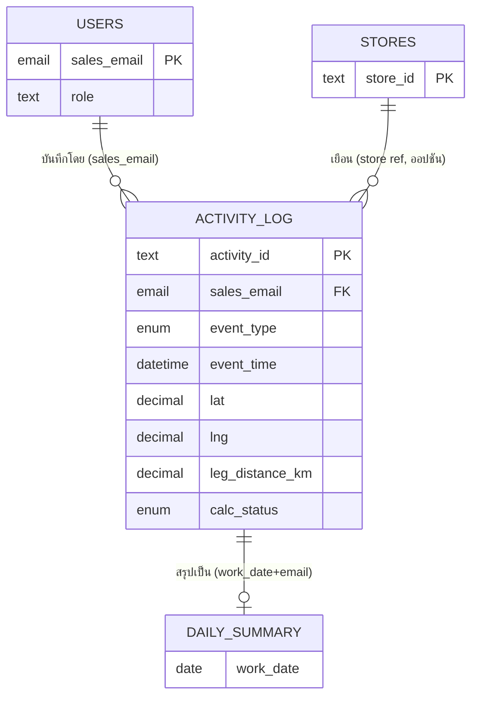

# 02 — Data Model (พจนานุกรมข้อมูล)

Google Sheet เดียว ชื่อ `YourFin Rider KPI` ประกอบด้วย 4 แท็บ นำเข้าได้จาก `sheets-templates/`

> ⚠️ **สำคัญ:** ตั้ง Time zone ของไฟล์เป็น **(GMT+07:00) Bangkok** ที่ `File ▸ Settings ▸ Time zone`
> เพราะ `TODAY()`, `NOW()` และการจัดกลุ่ม `work_date` อิงค่านี้

---

## 2.1 แท็บ `Activity_Log` — ตารางธุรกรรมหลัก (หัวใจของระบบ)

ทุกแถว = 1 เหตุการณ์ GPS (เริ่มงาน / เข้าพบร้าน / เลิกงาน)

| # | คอลัมน์ | ชนิด (AppSheet) | ใครเขียน | คำอธิบาย |
|---|---|---|---|---|
| A | `activity_id` | Text (Key) | AppSheet `UNIQUEID()` | รหัสเฉพาะของแถว |
| B | `sales_email` | Email | AppSheet `USEREMAIL()` | อีเมลเซลล์ (ใช้ทำ security filter + จัดกลุ่ม) |
| C | `sales_name` | Text | AppSheet (lookup จาก `Users`) | ชื่อเซลล์ (ไว้โชว์) |
| D | `event_type` | Enum | AppSheet | `CLOCK_IN` / `CHECK_IN` / `CLOCK_OUT` |
| E | `event_time` | DateTime | AppSheet `NOW()` | เวลาที่เกิดเหตุการณ์ |
| F | `work_date` | Date | AppSheet `TODAY()` | วันทำงาน (ใช้จัดกลุ่ม/รายงาน) |
| G | `geo` | LatLong | AppSheet `HERE()` | พิกัดดิบ "lat, lng" จากอุปกรณ์ |
| H | `lat` | Decimal | AppSheet (app formula) | `LATITUDE([geo])` — แยกไว้ให้ Looker/สูตรใช้ |
| I | `lng` | Decimal | AppSheet (app formula) | `LONGITUDE([geo])` |
| J | `store_name` | Text | เซลล์กรอก | ชื่อร้าน (เฉพาะ CHECK_IN) |
| K | `brand` | Enum | เซลล์เลือก | `Samsung` / `Vivo` / `Oppo` / `Other` |
| L | `visit_status` | Enum | เซลล์เลือก | `สำเร็จ` / `รอตัดสินใจ` / `ปฏิเสธ` |
| M | `photo_url` | Image | AppSheet → Drive | รูปหน้าร้าน |
| N | `note` | LongText | เซลล์กรอก | บันทึกเพิ่มเติม |
| O | `prev_lat` | Decimal | **Apps Script** | lat ของจุดก่อนหน้า |
| P | `prev_lng` | Decimal | **Apps Script** | lng ของจุดก่อนหน้า |
| Q | `leg_distance_km` | Decimal | **Apps Script** | ระยะทางขับขี่จริงจากจุดก่อนหน้า (กม.) |
| R | `leg_duration_min` | Decimal | **Apps Script** | เวลาขับขี่โดยประมาณ (นาที) |
| S | `calc_status` | Enum | AppSheet=`PENDING`, แล้ว Apps Script อัปเดต | `PENDING`/`DONE`/`SKIP`/`ERROR` |
| T | `processed_at` | DateTime | **Apps Script** | เวลาเที่ประมวลผลเสร็จ |

> 🔒 **กฎทอง:** คอลัมน์ O–T เป็น *ของ Apps Script* — อย่าให้ AppSheet หรือคนแก้มือ
> (ตั้ง `Editable? = FALSE` ใน AppSheet) ยกเว้น `calc_status` ที่ AppSheet ตั้งค่าเริ่มต้น `PENDING`
>
> คอลัมน์ O–T ต้อง **เรียงติดกันตามนี้** (สคริปต์เขียนกลับทีละคอลัมน์โดยอ้างชื่อหัวตาราง
> แต่เรียงติดกันช่วยให้ debug ง่าย)

### Enum ที่ใช้
- `event_type`: `CLOCK_IN`, `CHECK_IN`, `CLOCK_OUT`
- `brand`: `Samsung`, `Vivo`, `Oppo`, `Other`
- `visit_status`: `สำเร็จ`, `รอตัดสินใจ`, `ปฏิเสธ`
  *(ค่าภาษาไทยเป๊ะ ๆ มีผลต่อสูตรนับและสีหมุด — ห้ามพิมพ์ต่างกัน)*

---

## 2.2 แท็บ `Users` — ทะเบียนเซลล์/ผู้ใช้

| คอลัมน์ | ชนิด | คำอธิบาย |
|---|---|---|
| `sales_email` | Email (Key) | ใช้แมตช์กับ `USEREMAIL()` |
| `sales_name` | Text | ชื่อ-สกุล |
| `phone` | Phone | เบอร์ติดต่อ |
| `team` | Text | ทีม/สังกัด |
| `region` | Text | พื้นที่รับผิดชอบ |
| `role` | Enum | `Sales` / `Manager` / `Admin` (คุมสิทธิ์ในแอป) |
| `active` | Enum | `Y` / `N` |
| `target_daily_close` | Number | เป้าปิดดีลต่อวัน (ไว้เทียบ KPI) |
| `photo_url` | Image | รูปโปรไฟล์ (ออปชัน) |

---

## 2.3 แท็บ `Stores` — ทะเบียนร้านค้า (Master, ออปชันแต่แนะนำ)

ช่วย dedupe ร้านซ้ำ และติดตามสถานะคู่ค้าในระยะยาว (ร้านหนึ่งถูกเยือนหลายครั้งได้)

| คอลัมน์ | ชนิด | คำอธิบาย |
|---|---|---|
| `store_id` | Text (Key) | `UNIQUEID()` |
| `store_name` | Text | ชื่อร้าน |
| `brand` | Enum | แบรนด์หลักที่ร้านขาย |
| `province` / `district` | Text | จังหวัด/อำเภอ-เขต |
| `address` | Text | ที่อยู่ |
| `lat` / `lng` | Decimal | พิกัดร้าน |
| `partner_status` | Enum | `Prospect` / `Active` / `Closed` |
| `first_visit_date` | Date | วันที่เยือนครั้งแรก |
| `owner_contact` | Phone | เบอร์เจ้าของร้าน |
| `created_by` | Email | เซลล์ผู้สร้าง |

> **v1 เริ่มง่าย ๆ:** ใช้ `store_name` แบบ free-text ใน `Activity_Log` ไปก่อนได้
> แล้วค่อยยกระดับเป็น Ref ไป `Stores` เมื่ออยากได้ทะเบียนคู่ค้าแบบสมบูรณ์

---

## 2.4 แท็บ `Daily_Summary` — สรุปรายวัน (สูตร หรือ Apps Script)

สรุปต่อ (วันทำงาน × เซลล์):

| คอลัมน์ | ที่มา |
|---|---|
| `work_date`, `sales_email`, `sales_name` | คีย์จัดกลุ่ม |
| `total_checkins` | นับ `CHECK_IN` |
| `success` / `pending` / `reject` | นับตาม `visit_status` |
| `total_distance_km` | ผลรวม `leg_distance_km` |
| `conversion_rate` | `success / total_checkins` |
| `first_event` / `last_event` / `active_hours` | เวลาแรก–สุดท้าย และชั่วโมงทำงาน |

สร้างได้ 2 ทาง: **สูตร** (`docs/05`) สำหรับเรียลไทม์ หรือ **`buildDailySummary()`** เมื่อข้อมูลเยอะ

---

## 2.5 ER เชิงตรรกะ

ต่อด้วย → [`03-frontend-appsheet.md`](03-frontend-appsheet.md)
