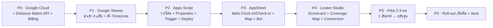

# 08 — แผนสร้าง นำร่อง และโรลเอาต์ (Rollout Plan)

## 8.1 ลำดับการสร้าง (Build Order) — ตามความเชื่อมโยงของระบบ

| เฟส | งานหลัก | เอกสารอ้างอิง | Definition of Done |
|---|---|---|---|
| **P0** | เปิดโปรเจกต์ Cloud, เปิด Distance Matrix API, ตั้ง Billing, สร้าง+restrict API key | `04 ▸ 4.1` | `testDistance()` คืน `ok:true` |
| **P1** | สร้าง Sheet, นำเข้า `sheets-templates/`, ตั้ง Timezone = Bangkok | `02` | 4 แท็บครบ หัวตารางตรง |
| **P2** | วางโค้ด, ใส่ `MAPS_API_KEY`/`WEBHOOK_SECRET`, `setupTriggers()`, Deploy web app | `04` | แถวทดสอบได้ `calc_status=DONE` |
| **P3** | สร้างแอป, ฟอร์ม, Map หมุดสี, Security filter, Bot→webhook | `03` | เช็คอินจริงจากมือถือ → ระยะทางขึ้นใน Sheet |
| **P4** | ต่อ Looker, calculated fields, Scorecard, Coverage Map, ฟิลเตอร์ | `06` | ผู้บริหารเปิดดูเองได้ |
| **P5** | นำร่อง 2–3 เซลล์ 1 สัปดาห์ เก็บ feedback | `08 ▸ 8.2` | ข้อมูลไหลครบ loop, แก้ปัญหา UX |
| **P6** | อบรมทีม, เขียน SOP, โรลเอาต์เต็ม | `08 ▸ 8.3` | ทุกคนใช้งานประจำวัน |

---

## 8.2 Pilot Checklist (สัปดาห์นำร่อง)

- [ ] เซลล์นำร่องกด **Clock-in** ตอนเริ่มงานได้ทุกวัน
- [ ] **Check-in** ครบ: ชื่อร้าน/แบรนด์/สถานะ/รูป + GPS ติดอัตโนมัติ
- [ ] **ระยะทาง** ถูกเขียนกลับภายในไม่กี่นาที (`calc_status=DONE`)
- [ ] **Map ในแอป** หมุดสีถูกต้องตามสถานะ
- [ ] **Looker** ตัวเลขตรงกับความจริง (สุ่มตรวจ 2–3 ราย)
- [ ] ทดสอบ **offline**: ปิดเน็ตตอนเช็คอิน แล้วเปิด → sync เข้าครบ
- [ ] ตรวจ **ต้นทุน API** ใน Cloud Billing เทียบประมาณการ
- [ ] เก็บ feedback UX (ฟอร์มยาวไป/ปุ่มหายาก/ฯลฯ)

---

## 8.3 การนำไปใช้จริง & การยอมรับของทีม (Adoption)

- **อบรมสั้น 30 นาที** + การ์ดสรุป 1 หน้า (กด Clock-in → เข้าร้าน → Check-in → ถ่ายรูป)
- **ทำให้ง่ายกว่าวิธีเดิม**: ฟอร์มต้องจบใน ~15 วินาที ไม่งั้นเซลล์จะไม่กรอก
- **ผูกกับ incentive**: ใช้ตัวเลขจาก dashboard กับการให้คอมมิชชัน/รางวัล เพื่อให้ทีมอยากบันทึก
- **ผู้บริหารใช้ dashboard แทนการประชุม** อย่างจริงจัง (ถ้ายังเรียกประชุมอัปเดต ทีมจะเลิกใช้ระบบ)
- ตั้ง **ผู้ดูแลระบบ (system owner)** 1 คน + บัญชี owner กลาง

---

## 8.4 Definition of Done ของทั้งระบบ

ระบบ "เสร็จ" เมื่อ:
1. เซลล์บันทึกงานจากมือถือได้ครบ loop (clock-in → check-in → รูป → GPS)
2. ระยะทางขับขี่จริงถูกคำนวณและเขียนกลับอัตโนมัติ (near real-time)
3. ผู้บริหารเปิด Looker เห็น **ยอดปิดดีลรายวัน, ระยะทางรวม, Coverage Map, Conversion Rate** ได้เอง
4. ไม่ต้องมีการประชุมอัปเดตงานประจำวันอีก (**Zero-Meeting สำเร็จ**)

---

## 8.5 ส่วนต่อยอดในอนาคต (Backlog)

- ทะเบียนร้านค้า `Stores` แบบ Ref เต็มรูปแบบ + กันเยือนซ้ำ
- เป้า KPI รายบุคคล/ทีม + แจ้งเตือนเมื่อต่ำกว่าเป้า (Apps Script ส่ง LINE Notify/อีเมล)
- เส้นทางที่เหมาะสุด (route optimization) ช่วยวางแผนวันถัดไป
- ย้าย pipeline → BigQuery เมื่อสเกลใหญ่
- อัปเกรด Distance Matrix → **Routes API** (แก้แค่ `DistanceMatrix.gs`)

---

กลับไปหน้าแรก → [`../README.md`](../README.md)
